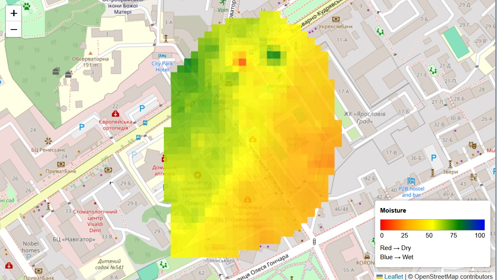

# geotiff_maker

## Description

`geotiff_maker` creates a single-band GeoTIFF from point-based ground data readings.
It reads a CSV file containing moisture samples, interpolates those values across a raster
grid, clips the result to a farm boundary from GeoJSON, and writes an output GeoTIFF in
`EPSG:4326`.

The generated raster stores moisture as byte values from `0` to `100`, where each value
represents a percent level of data. Pixels outside the boundary, or beyond the
optional distance limit, are written as NoData.

<p align="center">
  
</p>

## Usage

The CLI entrypoint is `make_geotiff.py`, which expects:

- A CSV file with the columns `moisture`, `latitude`, `longitude`, and `sampled_at`
- A boundary GeoJSON file containing a `Polygon` or `MultiPolygon`

Example CSV header:

```csv
moisture,latitude,longitude,sampled_at
```

Run locally:

```bash
python make_geotiff.py input/farm_moisture_200.csv --boundary-geojson input/farm_boundary.geojson
```

This writes the output GeoTIFF to the `output/` directory by default.

Useful options:

```bash
python make_geotiff.py input/farm_moisture_200.csv \
  --boundary-geojson input/farm_boundary.geojson \
  --output output/farm_moisture.tif \
  --resolution-m 10 \
  --max-distance-m 50 \
  --nodata 255
```

Option summary:

- `--boundary-geojson`: required path to the farm boundary file
- `--output` or `-o`: output directory or explicit `.tif` / `.tiff` file path
- `--resolution-m`: approximate raster resolution in meters, default `10`
- `--max-distance-m`: optional maximum distance from a sample point before a pixel becomes NoData
- `--nodata`: NoData byte value written to the GeoTIFF, must be between `101` and `255`

Run with Docker Compose:

```bash
docker compose build
docker compose run --rm geotiff_maker python make_geotiff.py input/farm_moisture_200.csv --boundary-geojson input/farm_boundary.geojson
```
